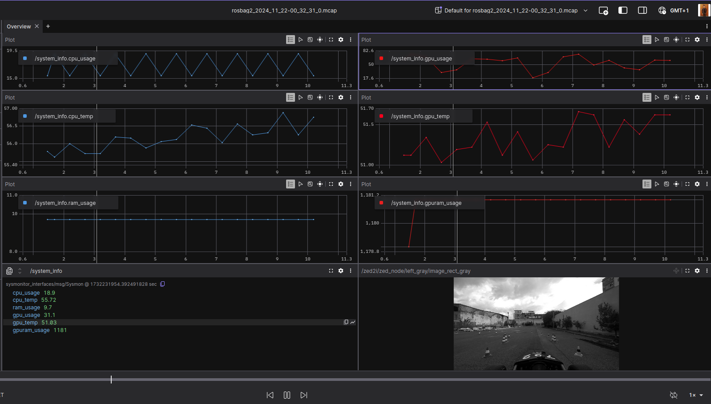

# UniNa Corse - ROS2 Exercises

This repository contains solutions for ROS2 exercises from the UniNa Corse racing team.

## Exercise 1

### Solutions

📄 **[View detailed answers and commands →](Answers/EX1.txt)**

### Visualizations

#### Foxglove System Monitoring Plot


#### Test Topic Publisher


### Implementation

The custom publisher node is implemented in C++ and can be found in `colcon_ws/src/ex1/`. The node subscribes to `/system_info` and publishes to `/test` at the same rate (2 Hz).

---

## Building the Workspace

```bash
cd colcon_ws
colcon build
source install/setup.bash
```

## Running the Exercises

### Exercise 1

```bash
# Terminal 1: Play the bag
ros2 bag play Bags/rosbag2_2024_11_22-00_32_31/

# Terminal 2: Run the publisher node
ros2 run ex1 test_publisher
```

---
