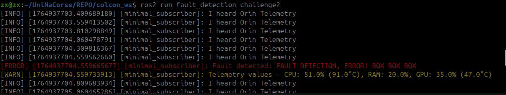

# UniNa Corse - ROS2 Exercises

This repository contains solutions for ROS2 exercises from the UniNa Corse racing team.

## Exercise 1

### Solutions

📄 **[View detailed answers and commands →](Answers/EX1.txt)**

### Visualizations

#### Foxglove System Monitoring Plot


#### Test Topic Publisher


### Implementation

The custom publisher node is implemented in C++ and can be found in `colcon_ws/src/ex1/`. The node subscribes to `/system_info` and publishes to `/test` at the same rate (2 Hz).

---

## Building the Workspace

```bash
cd colcon_ws
colcon build
source install/setup.bash
```

## Running the Exercises

### Exercise 1

```bash
# Terminal 1: Play the bag
ros2 bag play Bags/rosbag2_2024_11_22-00_32_31/

# Terminal 2: Run the publisher node
ros2 run ex1 test_publisher
```

---

## Exercise 2

### Bugs Found and Fixes

#### 1. Missing Dependency in CMakeLists.txt
**Issue:** `sysmonitor_interfaces` package not found during build of `fault_detection`.

**Solution:** Add the following line to `CMakeLists.txt`:
```cmake
find_package(sysmonitor_interfaces REQUIRED)
```

#### 2. Missing Semicolon in main.cpp
**Issue:** Missing semicolon at the end of `using std::placeholders::_1`.

**Solution:** Add semicolon after the using directive.

#### 3. Incorrect Node Initialization
**Issue:** Missing colon in the constructor initialization.

**Solution:** Change to:
```cpp
MinimalSubscriber() : Node("minimal_subscriber")
```

#### 4. Unhandled Invalid Argument Error
**Issue:** The node terminates due to an invalid argument error without proper error handling.

**Solution:** Wrap the code in try-catch blocks to handle exceptions gracefully.

📄 **[View main.cpp →](colcon_ws/src/fault_detection/src/main.cpp)**

#### Catch Error Visualization

